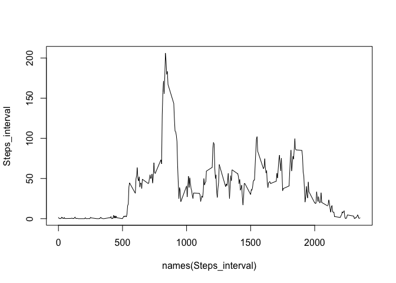

# Reproducible Research: Peer Assessment 1


## Loading and preprocessing the data

### Libraries needed
```{r]
library(knitr)
library(dplyr)
library(data.table)
library(tidyr)
library(ggplot2)
library(ggthemes)

```

### Set working directory

```r
setwd("/Users/taejinjo/OneDrive/Data_Analytics/05.RepData/Week2/RepData_PeerAssessment1")
```

### Loanding data and unzip to exiting directory

```r
my.file = "Dataset.zip"
if (!file.exists(my.file)) {
retval = download.file("https://d396qusza40orc.cloudfront.net/repdata%2Fdata%2Factivity.zip", destfile = my.file, method = "curl")
}
unzip(zipfile="./Dataset.zip",exdir="./data")
Dataset <- read.csv("./data/activity.csv", header = TRUE)
Dataset$date <- as.Date(Dataset$date)
str(Dataset)
```

```
## 'data.frame':	17568 obs. of  3 variables:
##  $ steps   : int  NA NA NA NA NA NA NA NA NA NA ...
##  $ date    : Date, format: "2012-10-01" "2012-10-01" ...
##  $ interval: int  0 5 10 15 20 25 30 35 40 45 ...
```

## What is mean total number of steps taken per day?

Remove "NA" data in Dataset

```r
Dataset_rm <- Dataset[which(!is.na(Dataset$steps)),]
```

1. Get sum of Dataset$steps by date

```r
Steps_perday <-tapply(Dataset_rm$steps, Dataset_rm$date, sum)
```

2. Histogram of total numbers of the steps per day

```r
hist(Steps_perday, 20)
```


3. Calculate mean and median of the total steps taken per day

```r
mean(Steps_perday)
```

```
## [1] 10766.19
```

```r
median(Steps_perday)
```

```
## [1] 10765
```

## What is the average daily activity pattern?

1. Get sum by interval

```r
Steps_interval <-tapply(Dataset_rm$steps, Dataset_rm$interval, mean)
plot(y = Steps_interval, x= names(Steps_interval), type ="l")
```


2. Find out the maximum average number of steps

```r
Max_Steps_interval <- Steps_interval[Steps_interval==max(Steps_interval)]
Max_Steps_interval
```

```
##      835 
## 206.1698
```

## Imputing missing values
1. Find out number of missing values in the data

```r
sum(is.na(Dataset))
```

```
## [1] 2304
```

```r
sum(is.na(Dataset$steps))
```

```
## [1] 2304
```

```r
sum(is.na(Dataset$date))
```

```
## [1] 0
```

```r
sum(is.na(Dataset$interval))
```

```
## [1] 0
```
-> We know that there are missing values in the steps

2. Replace NA with the corresponding mean of the related 5-minutes interval

```r
New_dataset <- Dataset
New_dataset[which(is.na(New_dataset$steps)),1] <- Steps_interval[as.character(New_dataset[which(is.na(New_dataset$steps)),3])]
```

3. Check the missing value, if any.

```r
sum(is.na(New_dataset))
```

```
## [1] 0
```

4. Get new mean and median of the new dataset with NA replaced by corresponding mean of the steps 

```r
New_steps_perday <- tapply(New_dataset$steps, New_dataset$date, sum)
mean(New_steps_perday)
```

```
## [1] 10766.19
```

```r
median(New_steps_perday)
```

```
## [1] 10766.19
```

5. Compare result of New dataset vs. Old dataset

```r
mean(Steps_perday)-mean(New_steps_perday)
```

```
## [1] 0
```

```r
median(Steps_perday)-median(New_steps_perday)
```

```
## [1] -1.188679
```
-> result shows there are no significant changes.

## Are there differences in activity patterns between weekdays and weekends?

1. Create a factor that indicates "weekdays" and "weekends"

```r
days <- weekdays(New_dataset$date)
for (i in 1:length(days)) {
        if (days[i] %in% c("Saturday", "Sunday")) days[i] = "Weekends"
        else days[i] = "Weekdays" }
New_dataset$day <- as.factor(days)
```

2. Make a panel plot of the 5-minute interval(x-axis), and the average number of the steps taken, averaged across all weekday and weekends (x-axis)

```r
Mean_by_days <- aggregate(steps ~ interval + days, data = New_dataset, mean)
Mean_by_days_weekends <- subset(Mean_by_days, Mean_by_days$days == "Weekends")
Mean_by_days_weekdays <- subset(Mean_by_days, Mean_by_days$days == "Weekdays")
```

3. Draw plot to compare results by weekdays and weekends

```r
par(mfrow = c(2,1))
plot(y = Mean_by_days_weekdays$steps, x = Mean_by_days_weekdays$interval, type = "l")
plot(y = Mean_by_days_weekends$steps, x = Mean_by_days_weekends$interval, type = "l")
```


```r
## ggplot(Mean_by_days, aes(x = interval, y = steps)) + geom_line(color = "blue") + facet_wrap( ~ days, nrow = 1, ncol = 2) + theme_wsj()
```

-> Maximum of weekdays is over 200 while that of weekends have slightly over 150, in addition, weekends have more steps through out the day compared to that of the weekdays.
